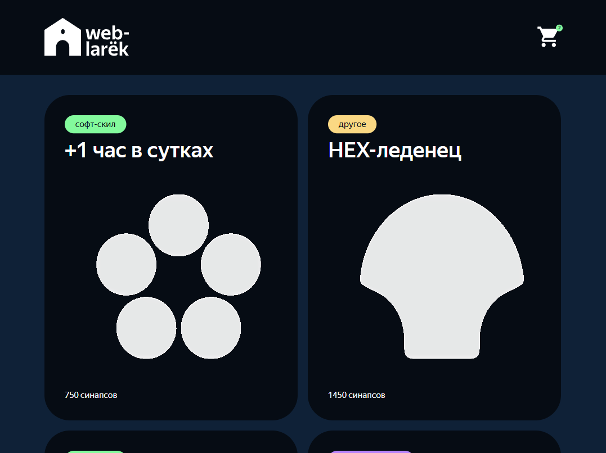

# Интернет-магазин «Web-Larek»

«Web-Larek» — это интернет-магазин с товарами для веб-разработчиков, где пользователи могут просматривать товары, добавлять их в корзину и оформлять заказы. Сайт предоставляет удобный интерфейс с модальными окнами для просмотра деталей товаров, управления корзиной и выбора способа оплаты, обеспечивая полный цикл покупки.

Проект создан для практики построения MVP-архитектуры веб-приложения на классах JavaScript с типизацией TypeScript. Проект предполагает изучение типов, включая дженерики, условные типы и интерфейсы, а также применение принципов ООП и паттернов проектирования для создания масштабируемого и поддерживаемого кода.

[Сайт на github-pages](https://anna-kobis.github.io/web-larek/) | [Макет в Figma](https://www.figma.com/design/50YEgxY8IYDYj7UQu7yChb/) | [Коллекция в Postman](https://larek-api.nomoreparties.co/weblarek.postman.json) | [Описание архитектуры](./docs/architecture/README.md)



## Функционал приложения

- Отображение товаров: загрузка и отображение списка доступных товаров с их изображениями, названиями и ценами с сервера.
- Детальное описание товара: открытие модального окна с полной информацией о товаре при клике на его карточку.
- Добавление в корзину: реализация функции добавления товара в корзину через кнопку "В корзину" в модальном окне.
- Корзина: открытие модального окна корзины с отображением добавленных товаров и счетчиком.
- Подсчет стоимости заказа: отображение итоговой суммы всех товаров в модальном окне корзины.
- Удаление из корзины: возможность удаления товаров из корзины с автоматическим обновлением общей стоимости.
- Выбор способа оплаты: предоставление пользователям опции выбора метода оплаты и ввода адреса доставки.
- Заполнение контактных данных: открытие модального окна для ввода Email и телефона перед подтверждением заказа.
- Подтверждение заказа: отображение модального окна с уведомлением об успешном оформлении заказа.
- Хранение состояния форм: сохранение состояния форм оформления заказа при закрытии модальных окон.

## Стек технологий

- Верстка на HTML5. Стилизация на препроцессоре SCSS с использованием вложенности, переменных и миксинов.
- Скрипты на TypeScript для типизации объектов и классов.
- Сборка на Webpack с траспиляцией TS с ts-loader и Babel и обработкой SCSS с sass-loader и PostCSS, включая преобразование в CSS, минификацию и проставление вендорных префиксов.
- Подключены инструменты форматирования и линтинга: Prettier и ESLint.
- Для управления зависимостями использовался npm и yarn, для деплоя на GitHub Pages - gh-pages.

## Установка, запуск, сборка

1. Для начала работы необходимо клонировать репозиторий проекта с помощью следующей команды в терминале:

```bash
git clone https://github.com/anna-kobis/web-larek.git
```

2. Перейдите в директорию с проектом и установите необходимые зависимости с помощью команды:

```bash
npm install
```

или

```bash
yarn
```

3. Для запуска проекта в режиме разработки используйте команду:

```bash
npm run dev
```

или

```bash
yarn dev
```

Эта команда запустит локальный сервер и автоматически откроет проект в браузере.

Для корректной работы запросов к серверу необходимо добавить переменную `API_ORIGIN` в окружение. Ссылка на API находится в файле `.env.example.`

4. Для сборки проекта в продакшен-режиме выполните команду:

```bash
npm run build
```

или

```bash
yarn build
```

Собранные файлы будут помещены в папку `dist`.

Для сборки проекта в режиме разработки используйте команду:

```bash
npm run build:dev
```

или

```bash
yarn build:dev
```

В режиме dev-сборки отключены минимизация кода и оптимизация производительности, сохраняются комментарии и исходные имена классов и функций.

Webpack можно запустить в режиме наблюдения следующей командой:

```bash
npm run watch
```

или

```bash
yarn watch
```

В этом случае Webpack будет отслеживать изменения в исходных файлах и автоматически пересобирать проект при каждом сохранении изменений.

5. Для форматирования кода с помощью Prettier выполните команду:

```bash
npm run format
```

или

```bash
yarn format
```

Для автоматического исправления ошибок с помощью ESLint используйте команду:

```bash
npm run lint:fix
```

или

```bash
yarn lint:fix
```

6. Для деплоя проекта на GitHub Pages можно выполнить команду:

```bash
npm run deploy
```

или

```bash
yarn deploy
```

Эта команда автоматически соберет проект и опубликует его на GitHub Pages.

Для публикации необходимо создать удаленный репозиторий на вашем аккаунте GitHub и связать его с вашим локальным репозиторием.
